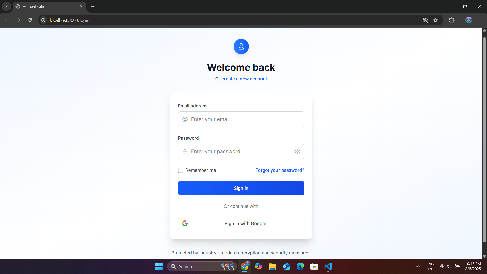
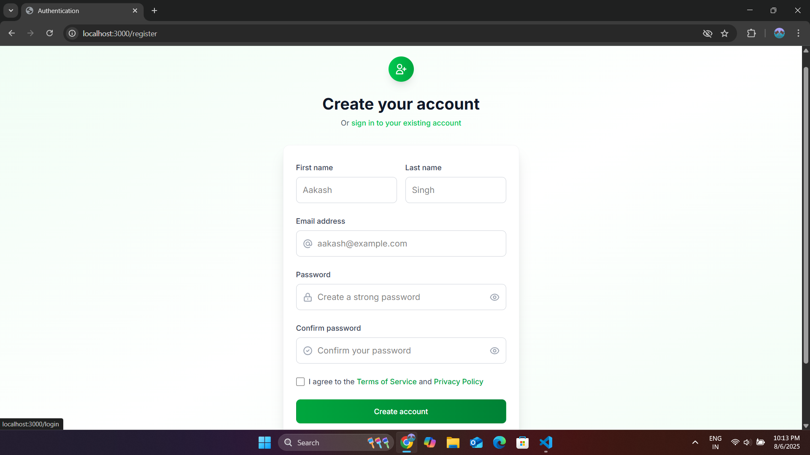
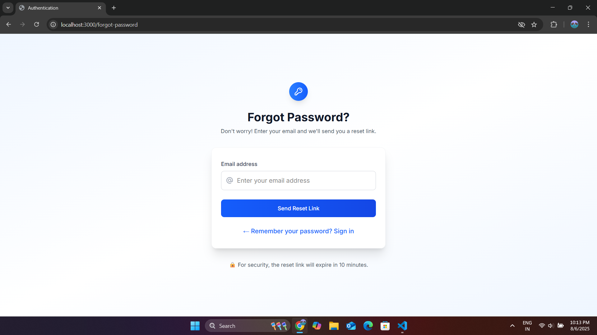
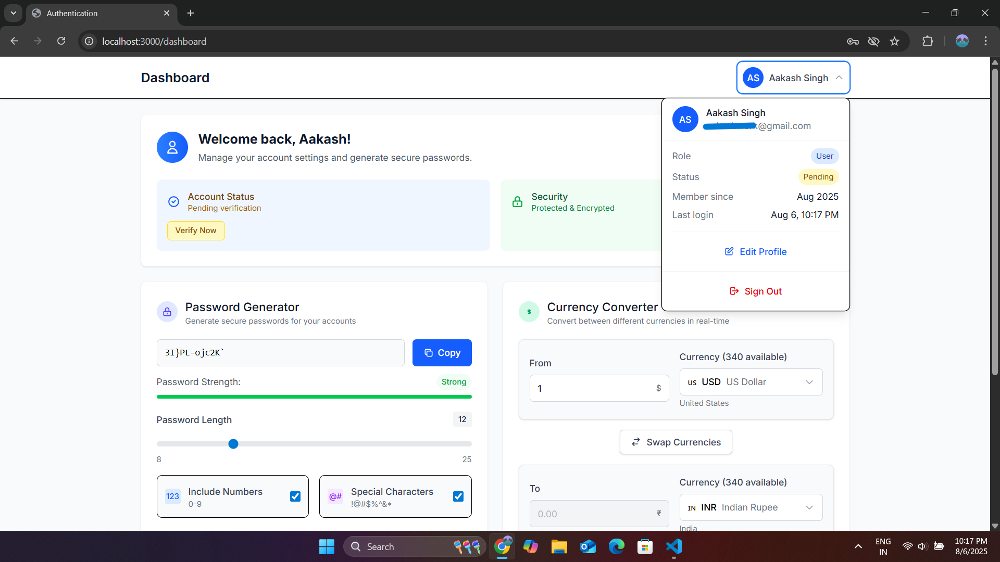
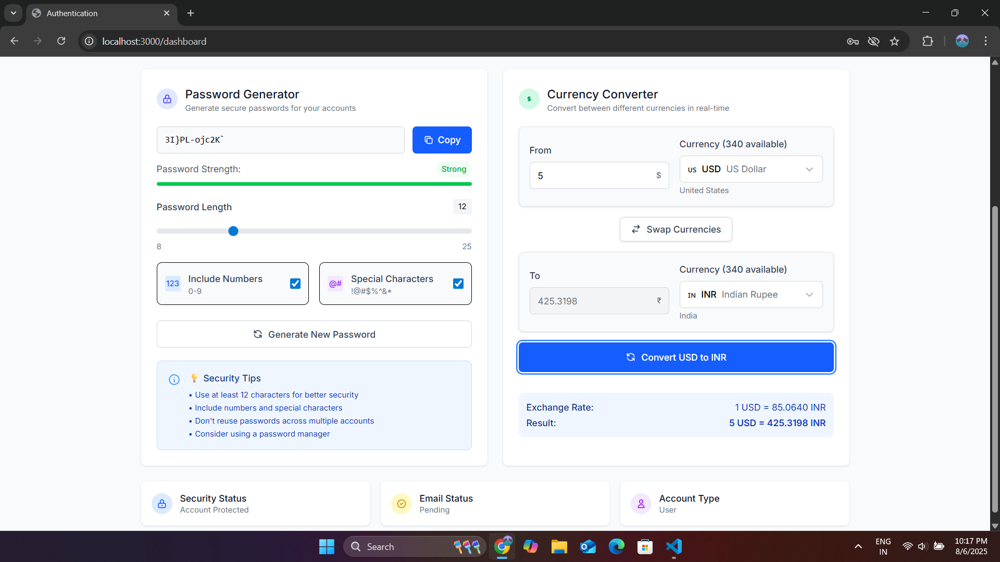

# MERN Authentication & Productivity Platform

A comprehensive full-stack web application featuring secure user authentication, Google OAuth integration, and productivity tools.

## Features

- **Complete Authentication System** with email verification
- **Google OAuth 2.0** integration with profile pictures
- **Password Generator** with customizable security parameters
- **Currency Converter** with real-time exchange rates
- **JWT-based session management** with auto-refresh
- **Professional UI** with responsive design

## Tech Stack

- **Frontend:** React, Tailwind CSS, Vite
- **Backend:** Node.js, Express.js, MongoDB
- **Authentication:** JWT, Google OAuth 2.0
- **Email Service:** Nodemailer

## Project Structure

- `frontend/` - React application
- `backend/` - Express.js API server

## Quick Start

1. Clone the repository
2. Install backend dependencies: `cd backend && npm install`
3. Install frontend dependencies: `cd frontend && npm install`
4. Set up environment variables (see individual README files)
5. Start backend: `cd backend && npm start`
6. Start frontend: `cd frontend && npm run dev`

## Documentation

- [Frontend Documentation](./frontend/README.md)
- [Backend Documentation](./backend/README.md)

## Security Features

- bcrypt password hashing
- JWT token management
- Rate limiting and account lockout
- CORS protection
- Input validation and sanitization

## Screenshot

  
  
  
  
  

  <b>Login</b> &nbsp;&nbsp;&nbsp;&nbsp;
  <b>Register</b> &nbsp;&nbsp;&nbsp;&nbsp;
  <b>Forgot Password</b> &nbsp;&nbsp;&nbsp;&nbsp;
  <b>Dashboard</b> &nbsp;&nbsp;&nbsp;&nbsp;
  <b>Components</b>

## Author

[Aakash Singh] - [https://www.linkedin.com/in/aakashsingh3/] - [aakashsinghsky3@gmail.com]
